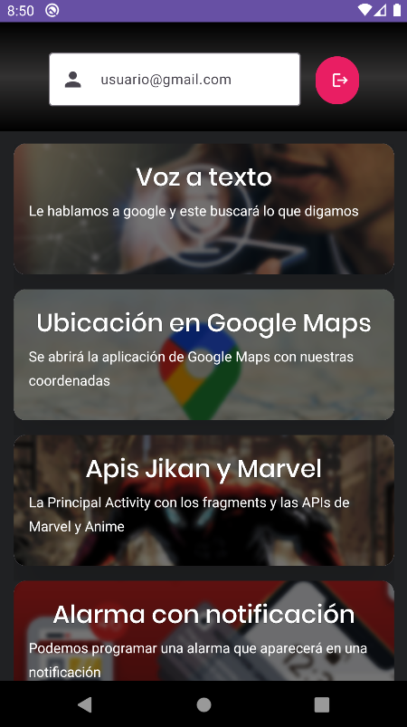
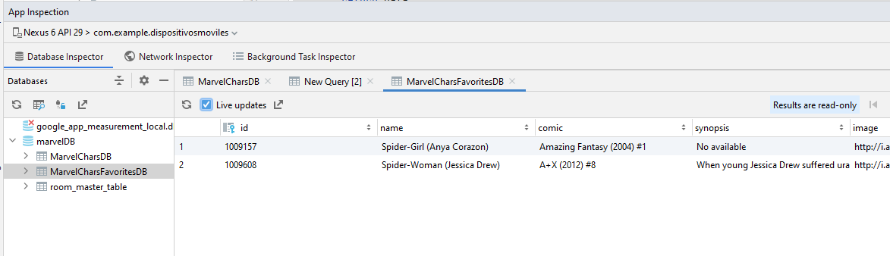

# Proyecto Final
Dispositivos móviles repositorio Cristian Arboleda y Kevin Toapanta

## MetaLaunch

## Características

- Programación de Notificaciones
- Consumo de API de Marvel Comics para mostrar información de personajes.
- Consumo de API de Jikan para mostrar información de anime. 
- Autenticación con huella digital para autenticación segura.
- Extensión para utilizar ChatGPT
- Integración con múltiples aplicaciones nativas como cámara, ubicación, speech-to-text, búsqueda por voz, alarma.
- Integración con Firebase para inicio de sesión utilizando correo electrónico y contrseña.
- Permite marcar como favoritos personajes de Marvel y administrar la lista de favoritos en una base de datos local.
- Diseño de tema oscuro personalizado. 
- Arquitectura MVVM para separar la capa de presentación de la lógica de negocio.
- Acceso seguro a APIs utilizando Token.
- Datos almacenados localmente de los personajes.
- Persistencia de datos de login
- Manejo de errores

## Librerías

### Gif

- **pl.droidsonroids.gif:android-gif-drawable:** Permite mostrar GIFs en ImageViews y otras vistas.

### Material 

- **com.google.android.material:material:** Provee los componentes de UI de Material Design como botones, cards, menus, etc.

### Retrofit

- **com.squareup.retrofit2:converter-gson:** Provee integración de Retrofit con Gson para serialización
- **com.squareup.retrofit2:retrofit:** Librería principal de Retrofit para realizar solicitudes HTTP a APIs de forma simple
  
### Firebase

- **com.google.firebase:firebase-auth-ktx:** Provee autenticación con Firebase. Permite login con email, phone, OAuth, etc. 
- **com.google.firebase:firebase-messaging:** Recibir y manejar mensajes push con Firebase Cloud Messaging.

### Corrutinas

- **org.jetbrains.kotlinx:kotlinx-coroutines-android:** Librería para simplificar código asíncrono en Android usando coroutinas.

### Room

- **androidx.room:room-runtime:** 
- **androidx.room:room-compiler:** Genera código en tiempo de compilación para Room.
- **androidx.room:room-ktx:** Extensión de Kotlin para usar Room de forma más idiomática.

### DataStore
- **androidx.datastore:datastore-preferences:** Almacenamiento de datos clave-valor. 

### Localización
- **com.google.android.gms:play-services-location:** Obtiene ubicación GPS del usuario.

### Core-KTX
- **androidx.core:core-ktx:** Extensión de Kotlin para clases core de Android como Context.

### ViewModel
- **androidx.fragment:fragment-ktx:** Extensión de Kotlin para Fragments. 
- **androidx.activity:activity-ktx:**
- **androidx.lifecycle:lifecycle-viewmodel-ktx:** Arquitectura para ViewModels.
- **androidx.lifecycle:lifecycle-livedata-ktx:** Notificaciones de cambios de datos para UIs.

### Biometric
- **androidx.biometric:biometric-ktx:** API para autenticación biométrica como huella.

### Shimmer
- **com.facebook.shimmer:shimmer:** Efecto de carga con brillos animado

# Resultados

  |  

# Login
- La primera pantalla es el inicio de sesión, el cual se realiza con Firebase Authentication y nos permite validar y crear usuarios de manera fácil y sencilla.

| |

- Los datos ingresados se almacenarán como sesión en el dispositivo.
  
 
  

- También tenemos botones que nos llevan a diferentes redes sociales, como Twitter y Facebook.
- Una vez dentro podremos regresar al Login solo si cerramos sesión, si presionamos el botón regresar 2 veces saldremos del aplicativo
  
   

# Menu
- Es la pantalla principal con el menú de funcionalidades de la app, cada funcionalidad tiene una descripción e imagen.

# Voz a Texto
- Nos permite utilizar el micrófono y hacer búsquedas para Google.
  
  

# Ubicación en mapa
- Nos permite acceder a la ubicación de nuestro dispositivo mediante Google Maps.
  
 

# APIs
- Se agrupan las Apis utilizadas de Marvel y Jikan mediante un NavBar.
- Las peticiones se realizaron con manejo de errores a nivel de SQL.
  
## Marvel API
- Nos muestra una lista de los personajes de Marvel directo desde la API
- La primera vez obtendrá los datos del API y los almacenará en una base de datos local.

 

- Podremos agregar a los elementos como favoritos, realizar búsquedas por nombre y abrir una nueva pantalla con más información. 

 

## Marvel API Favoritos
- Nos muestra a los elementos que establecemos como favoritos.
- Los elementos agregados a favoritos se almacenarán en una tabla de la base de datos local.
- Podremos eliminarlos de favoritos.
  
 

## Jikan API

- Nos muestra una lista de los animes que se encuentran en el top, asi como una pantalla con más detalle.
  
  

# Notificación Alarma
- Podemos programar notificaciones y alarmas dado una fecha.

 

# Camara
- Nos permite realizar fotografías y compartirlas.
  
  

# Chat GPT
- Es un módulo que ofrece la funcionalidad de Chat GPT.
  
 
